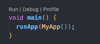
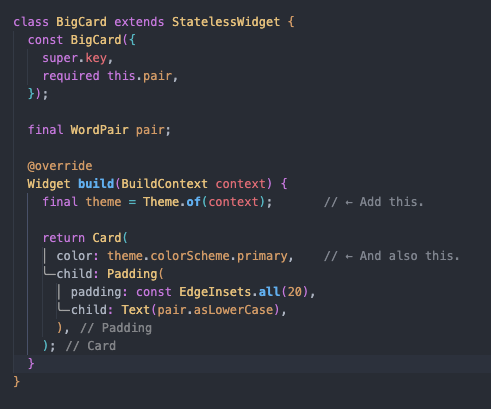
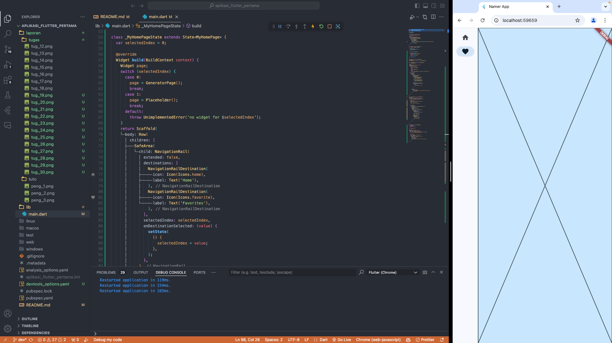

# Cara Menggunakan

1. Langkah 1: Pastikan Git Sudah Terpasang
   

2. Langkah 2: Dapatkan URL Repository GitHub
   

3. Langkah 3: Clone Repository Menggunakan Git
   

4. Langkah 4: Masuk ke Direktori Repository

Note : Sekarang, kamu bisa melihat, mengedit, atau menjalankan kode dari repository yang telah di-clone.

# Info Sekilas Sintax

1.  Membuat project

    - Membuat proyek Flutter pertama Anda
      

    - pubspec.yaml
      File pubspec.yaml menentukan informasi dasar tentang aplikasi Anda, seperti versi aplikasi saat ini, dependensi aplikasi, dan aset yang digunakan oleh aplikasi untuk pengiriman.
      

    - analysis_options.yaml
      File ini menentukan seberapa ketat Flutter saat menganalisis kode Anda. Karena percobaan ini adalah percobaan pertama Anda menggunakan Flutter, Anda memberi tahu penganalisis agar tidak terlalu ketat. Anda dapat mengatur ini kapan saja. Bahkan, seiring mendekati pemublikasian aplikasi produksi sebenarnya, Anda kemungkinan besar akan ingin membuat penganalisis lebih ketat dari ini.  
      

    - lib/main.dart
      50 baris kode ini adalah keseluruhan aplikasi sejauh ini.  

    <b>Catatan : </b> Codelab ini dipercepat hingga di titik Anda dapat mulai mengubah aplikasi secara interaktif—karena itu cara terbaik mempelajari Flutter. Jika Anda melewatkan penjelasan dari kode di atas, harap bersabar: penjelasannya akan diberikan.

2.  Menambahkan tombol

    - Meluncurkan aplikasi

      Pertama, buka lib/main.dart dan pastikan Anda memilih perangkat target. Di bagian pojok kanan bawah VS Code, Anda akan menemukan tombol yang menampilkan perangkat target saat ini. Klik tombol untuk mengubahnya.  
      

      Selagi lib/main.dart terbuka, temukan tombol "play" b0a5d0200af5985d.png di pojok kanan atas jendela VS Code lalu klik tombol tersebut.  
      

      Perhatikan bagaimana aplikasi segera berubah tetapi kata yang acak tetap sama. Situasi ini menunjukkan fitur stateful Hot Reload Flutter terkenal yang sedang bekerja. Hot reload dipicu saat Anda menyimpan perubahan untuk file sumber.
      

    - Menambahkan tombol
      Berikutnya, tambahkan tombol di bagian bawah Column, tepat di bawah instance Text kedua.

      lib/main.dart  
      

      Saat Anda menyimpan perubahan, aplikasi diperbarui kembali: Sebuah tombol muncul dan, saat Anda mengklik tombol tersebut, Konsol Debug di VS Code menampilkan pesan button pressed!.
      

    - Kursus singkat Flutter 5 menit
      Meskipun menyenangkan melihat Konsol Debug, Anda ingin tombol tersebut melakukan sesuatu yang lebih berguna. Namun, sebelum mencapai ke sana, perhatikan kode pada lib/main.dart lebih dekat, untuk memahami cara kerjanya.

      - lib/main.dart  
        

        Di bagian paling atas file tersebut, Anda akan menemukan fungsi main(). Dalam wujudnya saat ini, fungsi ini hanya memberi tahu Flutter untuk menjalankan aplikasi yang ditentukan pada MyApp.

      - lib/main.dart  
        

        Class MyApp memperluas StatelessWidget. Widget adalah elemen tempat Anda membangun setiap aplikasi Flutter. Seperti yang dapat Anda lihat, bahkan aplikasi itu sendiri adalah widget.

        <b>Catatan: </b> Kita akan mencapai penjelasan StatelessWidget (dibandingkan StatefulWidget) kemudian.

        Kode pada MyApp menyusun keseluruhan aplikasi. Kode ini membuat status seluruh aplikasi (Anda akan mempelajari hal ini lebih lanjut nanti), memberi nama aplikasi, menentukan tema visual, dan mengatur widget "home"—titik awal aplikasi Anda.

      - lib/main.dart  
        

        Berikutnya, class MyAppState menentukan...yah...status aplikasi. Percobaan ini adalah percobaan pertama Anda menggunakan Flutter, jadi codelab ini akan menjaga status aplikasi tetap sederhana dan terpusat. Ada banyak cara ampuh untuk mengelola status aplikasi di Flutter. Salah satu yang paling mudah untuk dijelaskan adalah ChangeNotifier, pendekatan yang diambil oleh aplikasi ini.

              - MyAppState menjelaskan data yang diperlukan oleh aplikasi ini agar berjalan dengan baik. Saat ini, kode ini hanya berisi variabel tunggal dengan pasangan kata acak saat ini. Anda akan menambahkannya nanti.
              - Class status memperluas ChangeNotifier, yang artinya kode ini dapat memberi tahu kode lain tentang perubahannya sendiri. Misalnya, jika pasangan kata saat ini berubah, beberapa widget dalam aplikasi perlu mengetahuinya.
              - Status dibuat dan disediakan untuk seluruh aplikasi menggunakan ChangeNotifierProvider (lihat kode di atas pada MyApp). Hal ini memungkinkan widget mana pun pada aplikasi untuk mendapatkan status.

        

      - lib/main.dart  
        

        Terakhir, ada MyHomePage, widget yang telah Anda modifikasi. Setiap baris bernomor di bawah memetakan ke komentar nomor baris pada kode di atas:

              - Setiap widget menentukan metode build() yang dipanggil secara otomatis setiap kali kondisi widget berubah agar widget selalu dalam kondisi terbaru.
              - MyHomePage melacak perubahan terhadap status aplikasi saat ini menggunakan metode watch.
              - Setiap metode build harus menampilkan widget atau (yang lebih umum) pohon widget bertingkat. Dalam hal ini, widget tingkat tertinggi adalah Scaffold. Anda tidak akan bekerja dengan Scaffold dalam codelab ini, tetapi ini adalah widget yang berguna dan dapat ditemukan di sebagian besar aplikasi Flutter di dunia nyata.
              - Column adalah salah satu widget tata letak paling dasar pada Flutter. Widget tata letak ini mengambil sejumlah turunan dan menempatkannya pada kolom dari atas ke bawah. Secara default, kolom menempatkan turunan-turunannya secara visual di bagian atas. Anda akan segera mengubah ini agar kolom terpusat di tengah.
              - Anda mengubah widget Text ini pada langkah pertama.
              - Widget Text kedua ini mengambil appState, dan mengakses satu-satunya anggota dari class tersebut, current (yang merupakan WordPair). WordPair menyediakan beberapa pengambil yang berguna, seperti asPascalCase atau asSnakeCase. Di sini, kita menggunakan asLowerCase, tetapi Anda dapat mengubah ini sekarang jika Anda lebih menyukai salah satu alternatif yang ada.
              -vPerhatikan bagaimana kode Flutter banyak menggunakan koma di akhir. Koma ini tidak harus ada, karena children adalah anggota terakhir (dan juga satu-satunya) dari daftar parameter Column ini. Namun, menggunakan koma di akhir umumnya adalah ide yang bagus: koma di akhir membuat penambahan anggota menjadi mudah, dan koma di akhir juga berfungsi sebagai petunjuk bagi pemformat otomatis Dart untuk meletakkan baris baru. Untuk informasi lebih lanjut, lihat panduan Pemformatan kode.

    - Perilaku pertama Anda
      Scroll ke MyAppState lalu tambahkan metode getNext.

      - lib/main.dart  
        

        Metode getNext() baru menetapkan ulang current dengan WordPair acak baru. Metode ini juga memanggil notifyListeners()(metode ChangeNotifier) yang memastikan bahwa semua orang yang melihat MyAppState diberi tahu.

        Tindakan terakhir adalah memanggil metode getNext dari callback tombol tersebut.

      - lib/main.dart  
        

        Simpan dan uji coba aplikasi sekarang. Aplikasi akan menghasilkan pasangan kata acak baru setiap kali Anda menekan tombol Next.

        Pada bagian berikutnya, Anda akan memperindah tampilan antarmuka pengguna.

3. Memperindah tampilan aplikasi
    - Mengekstrak widget

        Baris yang bertanggung jawab untuk menampilkan pasangan kata saat ini kini tampak seperti berikut: Text(appState.current.asLowerCase). Untuk mengubahnya menjadi sesuatu yang lebih kompleks, disarankan untuk mengekstrak baris ini ke widget terpisah. Memiliki beberapa widget untuk beberapa bagian logis dari UI Anda adalah cara penting dalam mengelola kompleksitas pada Flutter.

        Flutter menyediakan pembantu pemfaktoran ulang untuk mengekstrak widget, tetapi sebelum Anda menggunakannya, pastikan bahwa baris yang akan diekstrak hanya mengakses yang diperlukan. Sekarang baris tersebut mengakses appState, tetapi sebenarnya baris tersebut hanya perlu mengetahui apa pasangan kata saat ini.

        Oleh karena itu, tulis ulang widget MyHomePage sebagai berikut:

        - lib/main.dart
            

            Bagus. Widget Text tidak lagi merujuk kepada keseluruhan appState.

            Sekarang, panggil menu Refactor. Pada VS Code, Anda melakukan ini melalui salah satu dari dua cara:

            - Klik kanan potongan kode yang ingin Anda faktorkan ulang (dalam hal ini Text) dan pilih Refactor... dari menu drop-down,
            
            ATAU

            - Pindahkan kursor Anda ke potongan kode yang ingin Anda faktorkan ulang (dalam hal ini, Text), lalu tekan Ctrl+. (Win/Linux) atau Cmd+. (Mac).
                

            Pada menu Refactor, pilih Extract Widget. Tetapkan nama, seperti BigCard, lalu klik Enter.

        Tindakan ini secara otomatis membuat class baru, BigCard, di akhir file saat ini. Class tersebut akan terlihat seperti berikut:

        - lib/main.dart
            

    - Menambahkan Kartu
        Sekarang saatnya membuat widget baru ini menjadi UI tebal yang kita bayangkan di awal bagian ini.

        Temukan class BigCard dan metode build() yang berada di dalamnya. Sama seperti sebelumnya, panggil menu Refactor pada widget Text. Namun, kali ini Anda tidak akan mengekstrak widget.

        Sebagai gantinya, pilih Wrap with Padding. Tindakan ini menciptakan widget induk baru di sekitar widget Text bernama Padding. Setelah menyimpannya, Anda akan melihat bahwa kata acak tersebut telah memiliki ruang yang lebih luas.
            

        Berikutnya, mari kita naik satu tingkat lebih tinggi. Tempatkan kursor Anda pada widget Padding, buka menu Refactor, lalu pilih Wrap with widget....

        Tindakan ini memungkinkan Anda untuk menentukan widget induk. Ketik "Card" dan tekan Enter.
            

    - Tema dan gaya

        Untuk membuat kartu menjadi lebih menarik, beri warna yang lebih kaya pada kartu tersebut. Karena ada baiknya untuk menjaga skema warna yang konsisten, gunakan Theme aplikasi untuk memilih warna.

        Buat perubahan berikut untuk metode build() BigCard.
        - lib/main.dart
            

            Kedua baris baru ini melakukan banyak hal:

            - Pertama, kode ini meminta tema aplikasi saat ini dengan Theme.of(context).
            - Kemudian, kode ini menentukan warna kartu agar sama dengan properti colorScheme dari tema. Skema warna menampung banyak warna, dan primary adalah warna aplikasi yang paling terlihat dan mencolok.

                

    - TextTheme

        Kartu tersebut masih memiliki masalah: ukuran teks terlalu kecil dan warnanya membuat teks sulit dibaca. Untuk memperbaiki masalah ini, buat perubahan berikut pada metode build() BigCard.

        - lib/main.dart
            

            Yang ada di balik perubahan ini:

            - Dengan menggunakan theme.textTheme,, Anda mengakses tema font aplikasi. Class ini mencakup anggota seperti bodyMedium (untuk teks standar ukuran medium), caption (untuk teks dari gambar), atau headlineLarge (untuk judul berukuran besar).
            - Properti displayMedium adalah gaya font besar yang dimaksudkan untuk teks tampilan. Kata tampilan digunakan dalam artian tipografi di sini, seperti pada jenis huruf tampilan. Dokumentasi untuk displayMedium menyatakan bahwa, "gaya tampilan ditujukan untuk teks yang penting dan singkat"—tepat dengan kasus penggunaan kita.
            - Properti displayMedium tema secara teori dapat berupa null. Dart, bahasa pemrograman yang Anda gunakan untuk menulis aplikasi ini, aman dari null, sehingga bahasa pemrograman ini tidak akan mengizinkan Anda memanggil metode objek yang berpotensi null. Namun, dalam hal ini, Anda dapat menggunakan operator ! ("bang operator") untuk meyakinkan Dart bahwa Anda memahami tindakan Anda. (displayMedium pasti tidak null dalam kasus ini. Namun, alasan kami mengetahui hal ini berada di luar cakupan codelab ini.)
            - Memanggil copyWith() pada displayMedium menampilkan salinan gaya teks dengan perubahan yang Anda tentukan. Dalam hal ini, Anda hanya mengubah warna teks.
            - Untuk mendapatkan warna baru, Anda mengakses tema aplikasi sekali lagi. Properti onPrimary skema warna menentukan warna yang cocok digunakan untuk warna primer aplikasi.

    - Meningkatkan aksesibilitas

        Solusi sederhananya adalah dengan mengganti pair.asLowerCase dengan "${pair.first} ${pair.second}". Kode kedua menggunakan jenis interpolasi string untuk membuat string (seperti "cheap head") dari kedua kata yang tercakup dalam pair. Menggunakan dua kata terpisah sebagai ganti kata majemuk memastikan bahwa pembaca layar mengidentifikasi setiap kata dengan tepat, dan menyediakan pengalaman yang lebih baik untuk pengguna penyandang gangguan penglihatan.

        Namun, Anda mungkin ingin mempertahankan kesederhanaan visual pair.asLowerCase. Gunakan properti semanticsLabel Text untuk mengganti konten visual widget teks dengan konten semantik yang lebih sesuai untuk pembaca layar:

        - lib/main.dart
            
        
    - Menempatkan UI di tengah

        Setelah pasangan kata acak dihadirkan dengan gaya visual yang cukup, saatnya menempatkan UI di tengah jendela/layar aplikasi.

        Pertama, ingatlah bahwa BigCard adalah bagian dari Column. Secara default, kolom menggabungkan turunan kolom di bagian atas, tetapi kita dapat mengganti ini dengan mudah. Buka metode build() MyHomePage, dan buat perubahan berikut:

        - lib/main.dart
            

        Anda dapat menempatkan kolom itu sendiri di tengah. Letakkan kursor Anda di Column, buka menu Refactor (dengan Ctrl+. atau Cmd+.), lalu pilih Wrap with Center.
            

        Jika mau, Anda dapat menyesuaikan tampilan ini lebih lanjut.

        - Anda dapat menghapus widget Text di atas BigCard. Dapat dipastikan bahwa teks deskriptif ("Ide LUAR BIASA acak:") tidak lagi diperlukan karena UI tersebut sudah jelas meskipun tanpa teks deskriptif. Selain itu, dengan begitu UI terlihat lebih bersih.
        - Anda juga dapat menambahkan widget SizedBox(height: 10) di antara BigCard dan ElevatedButton. Dengan begitu, ada sedikit pemisah di antara kedua widget tersebut. Widget SizedBox hanya mengambil ruang dan tidak merender apa pun dengan sendirinya. Widget ini biasa digunakan untuk membuat "jarak" visual.

        Dengan perubahan opsional, MyHomePage mencakup kode berikut:

        - lib/main.dart
            

4. Menambahkan fungsi
    - Menambahkan logika bisnis
        Scroll ke MyAppState dan tambahkan kode berikut:

        - lib/main.dart
            
        
        - Periksa perubahannya:

            - Anda menambahkan properti baru pada MyAppState yang bernama favorites. Properti ini diinisialisasi dengan daftar kosong: [].
            - Anda juga menentukan bahwa daftar tersebut hanya dapat berisi pasangan kata: <WordPair>[], menggunakan generik. Hal ini membantu membuat aplikasi Anda menjadi lebih lengkap—Dart bahkan menolak menjalankan aplikasi jika Anda mencoba menambahkan apa pun selain WordPair. Oleh karena itu, Anda dapat menggunakan daftar favorites karena tidak boleh ada objek yang tidak diinginkan (seperti null) yang bersembunyi di dalamnya.
            - Anda juga menambahkan metode baru, toggleFavorite(), yang menghapus pasangan kata saat ini dari daftar favorit (jika sudah ada), atau menambahkannya (jika belum ada). Dalam kedua kasus tersebut, kode memanggil notifyListeners(); setelahnya.

        - Menambahkan tombol

            Dengan terselesaikannya "logika bisnis", saatnya untuk mengerjakan antarmuka pengguna kembali. Meletakkan tombol ‘Like' di sebelah kiri tombol ‘Next' memerlukan Row. Widget Row adalah padanan horizontal dari Column, yang telah Anda lihat sebelumnya.

            Pertama, gabungkan tombol yang ada pada Row. Buka metode build() MyHomePage, letakkan kursor pada ElevatedButton, buka menu Refactor dengan Ctrl+. atau Cmd+., lalu pilih Wrap with Row.

            

            Saat menyimpan, Anda akan menyadari bahwa Row bertindak mirip dengan Column—secara default, kode ini mengumpulkan turunannya ke sebelah kiri. (Column mengumpulkan turunannya ke atas.) Untuk memperbaiki masalah ini, Anda dapat menggunakan pendekatan yang sama seperti sebelumnya, tetapi dengan mainAxisAlignment. Namun, untuk tujuan mendidik (pembelajaran), gunakan mainAxisSize. Kode ini memberi tahu Row agar tidak mengambil semua ruang horizontal yang tersedia.

            - lib/main.dart
                

            Berikut satu cara untuk menambahkan tombol kedua untuk MyHomePage. Kali ini, gunakan konstruktor ElevatedButton.icon() untuk membuat tombol dengan ikon. Di bagian atas metode build, pilih ikon yang sesuai tergantung pada apakah pasangan kata saat ini sudah berada di favorit atau tidak. Selain itu, perhatikan penggunaan SizedBox lagi, untuk menjaga jarak antara kedua tombol.

            - lib/main.dart
                

5. Menambahkan kolom samping navigasi
    Untuk mencapai inti dari langkah ini secepat mungkin, pisahkan MyHomePage menjadi 2 widget terpisah.

    Pilih keseluruhan MyHomePage, hapus, dan gantikan dengan kode berikut:
    - lib/main.dart
        
    Periksa perubahannya

        - Pertama, perhatikan bahwa seluruh konten MyHomePage diekstrak ke dalam widget baru, GeneratorPage. Satu-satunya bagian dari widget MyHomePage lama yang tidak diekstrak adalah Scaffold.
        - MyHomePage baru berisi Row dengan dua turunan. Widget pertama adalah SafeArea, dan yang kedua adalah widget Expanded.
        - SafeArea memastikan bahwa turunannya tidak terhalang oleh notch hardware atau status bar. Dalam aplikasi ini, widget mengemas NavigationRail untuk mencegah tombol navigasi terhalang oleh status bar perangkat seluler, misalnya.
        - Anda dapat mengubah baris extended: false pada NavigationRail menjadi true. Kode ini menampilkan label di samping ikon. Pada langkah mendatang, Anda akan mempelajari cara melakukan ini secara otomatis saat aplikasi memiliki ruang horizontal yang cukup.
        - Kolom samping navigasi memiliki dua tujuan (Beranda dan Favorit), dengan ikon dan label masing-masing. Kolom samping navigasi juga menentukan selectedIndex saat ini. Indeks pilihan nol memilih tujuan pertama, indeks pilihan satu memilih tujuan kedua, dan seterusnya. Untuk saat ini, kolom samping navigasi di-hard code ke nol.
        - Kolom samping navigasi juga menentukan apa yang terjadi saat pengguna memilih salah satu tujuan dengan onDestinationSelected. Saat ini, aplikasi hanya menghasilkan nilai indeks yang diminta dengan print().
        - Turunan kedua Row adalah widget Expanded. Widget yang diperluas sangat berguna dalam baris dan kolom—widget tersebut memungkinkan Anda mengekspresikan tata letak tempat beberapa turunan hanya mengambil ruang sebanyak yang diperlukan (dalam hal ini, NavigationRail) dan widget lainnya harus mengambil ruang yang tersisa sebanyak mungkin (dalam hal ini, Expanded). Satu sudut pandang tentang widget Expanded adalah bahwa widget ini "serakah". Jika Anda ingin lebih memahami peran widget ini, coba gabungkan widget NavigationRail dengan Expanded lainnya. Tata letak yang dihasilkan terlihat seperti berikut:
            - Dua widget Expanded saling berbagi semua ruang horizontal yang tersedia, meskipun kolom samping navigasi hanya memerlukan sepotong kecil ruang di sisi kiri.
            - Di dalam widget Expanded, ada Container berwarna, dan ada GeneratorPage di dalam container.

    - Widget stateless versus stateful
        Sampai sekarang, MyAppState telah memenuhi semua kebutuhan status Anda. Itulah mengapa semua widget yang telah Anda tulis sejauh ini adalah stateless. Widget-widget tersebut tidak memiliki status yang dapat diubah. Tidak ada widget yang dapat mengubah widget itu sendiri—widget tersebut harus melalui MyAppState.

        Hal ini akan segera berubah.

        Anda memerlukan suatu cara untuk menyimpan nilai selectedIndex kolom samping navigasi. Anda juga ingin dapat mengubah nilai ini dari dalam callback onDestinationSelected.

        Anda dapat menambahkan selectedIndex sebagai properti tambahan MyAppState. Kode tersebut akan berfungsi. Namun, Anda dapat membayangkan bahwa status aplikasi akan tumbuh dengan cepat di luar kendali jika setiap widget menyimpan nilai masing-masing di dalamnya.

        Sebagian status hanya relevan untuk satu widget, sehingga status tersebut harus tetap dengan widget tersebut.

        Masukkan StatefulWidget, jenis widget yang memiliki State. Pertama, konversi MyHomePage menjadi widget stateful.

        Tempatkan kursor Anda di baris pertama MyHomePage (baris yang diawali dengan class MyHomePage...), lalu buka menu Refactor menggunakan Ctrl+. atau Cmd+.. Kemudian, pilih Convert to StatefulWidget.

    - setState

        Widget stateful baru hanya perlu melacak satu variabel: selectedIndex. Buat 3 perubahan berikut untuk _MyHomePageState:
        
        - lib/main.dart
            

     - Menggunakan selectedIndex  

        Tempatkan kode berikut di bagian atas metode build _MyHomePageState, tepat sebelum return Scaffold:   

        Periksa potongan kode berikut:

        - Kode tersebut mendeklarasikan variabel baru, page, dari jenis Widget.
        - Kemudian, pernyataan switch menetapkan layar untuk page, berdasarkan nilai saat ini pada selectedIndex.
        - Karena belum ada FavoritesPage, gunakan Placeholder; sebuah widget praktis yang menggambar kotak silang di tempat yang Anda pilih, menandai bagian UI tersebut sebagai tidak tuntas.
        - Dengan menerapkan prinsip gagal cepat, pernyataan switch juga memastikan untuk menampilkan kesalahan jika selectedIndex bukan 0 atau 1. Hal ini membantu mencegah munculnya bug. Jika Anda menambahkan tujuan baru ke kolom samping navigasi dan lupa mengupdate kode ini, program akan mengalami error dalam pengembangan (bukan membiarkan Anda menebak kenapa tidak bekerja, atau membiarkan Anda menerbitkan kode berisi bug ke dalam produksi).

        Berikut tampilan _MyHomePageState setelah satu perubahan tersebut:

        - lib/main.dart
            

    - Tingkat respons
        Berikutnya, buat kolom samping navigasi menjadi responsif. Dengan kata lain, buat agar kolom samping navigasi menampilkan label secara otomatis (menggunakan extended: true) saat ada ruang yang cukup.

        Flutter menyediakan berbagai widget yang membantu membuat aplikasi Anda menjadi responsif secara otomatis. Misalnya, Wrap adalah widget yang mirip dengan Row atau Column yang secara otomatis menggabungkan turunan ke "baris" berikutnya (yang disebut "run") saat ruang vertikal atau horizontal tidak mencukupi. Ada FittedBox, sebuah widget yang secara otomatis memasukkan turunannya ke dalam ruang yang tersedia berdasarkan spesifikasi Anda.

        Namun, NavigationRail tidak secara otomatis menampilkan label saat ruang tidak cukup karena kode tersebut tidak dapat mengetahui apa sebenarnya yang dimaksud dengan ruang yang cukup dalam setiap konteks. Pengambilan keputusan itu tergantung pada Anda sebagai developer.

        Misalnya, Anda memutuskan untuk menampilkan label hanya jika lebar MyHomePage setidaknya 600 piksel.

        Dalam hal ini, widget yang digunakan adalah LayoutBuilder. Widget ini memungkinkan Anda mengubah pohon widget tergantung pada seberapa banyak ruang yang tersedia yang dimiliki.

        Sekali lagi, gunakan menu Refactor Flutter di VS Code untuk membuat perubahan yang diperlukan. Namun, proses kali ini sedikit lebih rumit:

        - Dalam metode build _MyHomePageState, letakkan kursor Anda pada Scaffold.
        - Buka menu Refactor dengan Ctrl+. (Windows/Linux) atau Cmd+. (Mac).
        - Pilih Wrap with Builder dan tekan Enter.
        - Modifikasi nama Builder yang baru ditambahkan menjadi LayoutBuilder.
        - Modifikasi daftar parameter callback dari (context) menjadi (context, constraints).

        

        Callback builder LayoutBuilder dipanggil setiap kali batasan berubah. Misalnya, hal ini terjadi saat:

        - Pengguna mengubah ukuran jendela aplikasi
        - Pengguna memutar ponsel mereka dari mode potret menjadi mode lanskap, atau sebaliknya
        - Beberapa widget di samping MyHomePage membesar, sehingga membuat batasan MyHomePage mengecil
        - Dan seterusnya

        Sekarang kode Anda dapat memutuskan untuk menampilkan label dengan membuat kueri constraints saat ini atau tidak. Buat perubahan baris tunggal berikut untuk metode build _MyHomePageState:

        - lib/main.dart
            

6. Menambahkan halaman baru

    Berikut ini hanyalah salah satu cara untuk menerapkan halaman favorit. Bagaimana halaman ini diterapkan (semoga) akan menginspirasi Anda untuk bermain dengan kode—meningkatkan UI dan membuat UI sesuai keinginan Anda.

    Berikut class FavoritesPage baru:

    - lib/main.dart
        

        Inilah fungsi widget tersebut:

        - Widget ini mendapatkan status aplikasi saat ini.
        - Jika daftar favorit kosong, pesan terpusat berikut akan ditampilkan: No favorites yet*.*
        - Jika tidak, daftar (dapat di-scroll) akan ditampilkan.
        - Daftar tersebut dimulai dengan ringkasan (misalnya, You have 5 favorites*.*).
        - Kode tersebut kemudian melakukan iterasi di seluruh favorit dan membuat widget ListTile untuk masing-masing favorit.
        Yang tersisa sekarang adalah mengganti widget Placeholder dengan FavoritesPage. Dan selesai!

        

